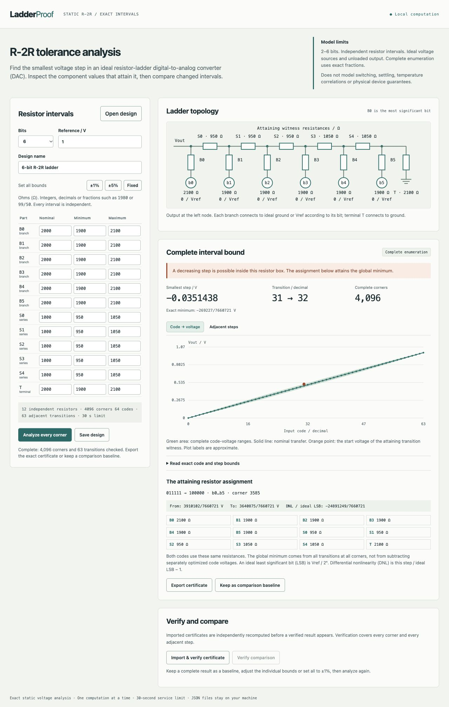

# LadderProof

LadderProof checks whether an ideal static R-2R resistor digital-to-analog converter (DAC) can decrease when its binary input increases. Enter an independent resistance interval for each component. It enumerates every admitted interval corner with exact fractions, reports the worst adjacent-code step and the resistor assignment that attains it, and exports a record that a separate verifier completely recomputes.

This is a small electrical analysis application, with an installed CLI and a local browser interface. It models 2–6 bit voltage-mode ladders with ideal switches, a fixed positive reference and an unloaded output. The result concerns the declared static resistor model. Actual switching glitches, settling, temperature, reference regulation and physical devices are outside it. See [the model and mathematical argument](docs/model.md).



## Try the complete workflow

Python 3.11 or newer is required. Runtime dependencies are all in the standard library. Install this checkout in a virtual environment:

```sh
python3 -m venv .venv
.venv/bin/python -m pip install .
.venv/bin/ladderproof serve
```

The browser application listens on the local loopback address. Use the terminal's URL. You can also perform every analysis/export/verification step from the CLI:

```sh
.venv/bin/ladderproof create --bits 6 --tolerance 1/20 --vref 1 --output loose.json
.venv/bin/ladderproof analyze loose.json --output loose-certificate.json
.venv/bin/ladderproof verify loose-certificate.json
.venv/bin/ladderproof create --bits 6 --tolerance 1/100 --vref 1 --output tighter.json
.venv/bin/ladderproof analyze tighter.json --output tighter-certificate.json
.venv/bin/ladderproof compare loose-certificate.json tighter-certificate.json
```

Edit the generated JSON to enter measured ranges or different nominal values for individual components. All numbers are exact strings such as `"2000"`, `"1999.125"` or `"15992/8"`. Certificate export normalizes them to reduced fractions; no binary floating-point values enter the analysis. Existing files are protected unless `--force` is supplied. A refused or interrupted computation cannot replace an earlier output even with `--force`. If interruption happens during the final atomic publication, the CLI asks you to check whether the complete new file was already written.

The six-bit examples in [examples/](examples/) demonstrate a real distinction: at independent ±5% resistance variation, a 31→32 decrease is attainable; at ±1%, every modeled adjacent step remains positive. At a 1 V reference the exact minimum steps are respectively `-269227/7660721 V` and `186147971/34016602567 V`. These are reproducible synthetic circuit calculations, not measurements from hardware.

## What the application computes

The nodal solver performs exact Gaussian elimination at every unique tolerance-box corner. Code steps compare **the same physical resistor assignment** on both sides. Every resistor has its own coordinate; fixed intervals do not add redundant corners. The largest admitted ladder has 12 resistors and 4,096 corners. Per-code voltage bounds and every adjacent-step bound include the lowest-mask endpoint witness that attains them.

The verifier uses independent backward Thevenin reductions, not the nodal solver. It re-enumerates all corners and recomputes all bounds, nominal values and witnesses. It validates global claims instead of only checking that the single adverse example is attainable. The exported record is a replayable computation certificate, not a succinct formal proof or cryptographic attestation.

The method and DAC architecture are established. The contribution here is bounded exact implementation, explicit component assumptions, inspectable attained transitions, complete independent verification and the usable analysis/edit/export workflow. [Sources and origins](docs/references.md) credit the circuit-analysis and exact-bounds lineage; this project is not a SPICE replacement.

## Limits and failures

Analysis and verification have an operation deadline, 30 seconds by default and at most 120 seconds. Use `--seconds 60` for an analysis requiring more local time. Cancellation, invalid models and resource refusal have distinct outcomes. No partial result acquires complete certificate status. The admitted bit count, exact-number sizes and JSON size are bounded before solving; see [the contract](docs/contracts.md).

An independent interval box can overstate what a matched or correlated resistor family permits. Do not treat its endpoint witness as an attainable correlated assignment, or interpret it as manufacturing yield. Correlations, arbitrary graph/netlist imports and nonlinear parts are deliberately refused.

## Development checks

```sh
PYTHONPATH=src python3 -m unittest discover -s tests -v
```

The tests exercise independently derived analytic ladders, the six-bit successful and failing interval cases, nonuniform values, certificate mutation, complete verification, cancellation, hostile inputs and the real CLI save/reopen/compare journey. [Verification notes](docs/verification.md) distinguish executed checks from remaining release checks.

Original code is MIT licensed. No credentials, remote service or hardware is required.
